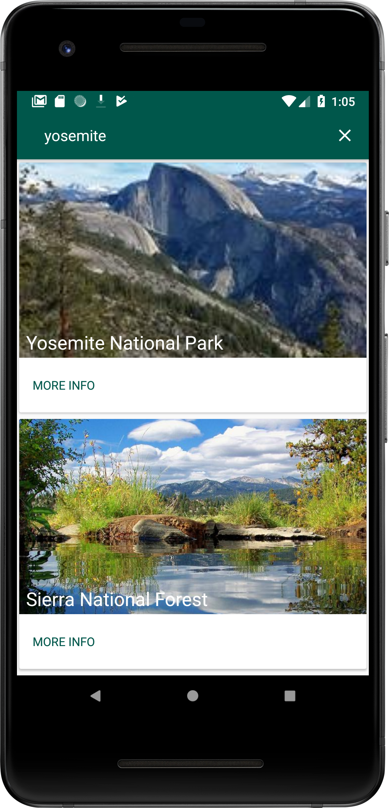
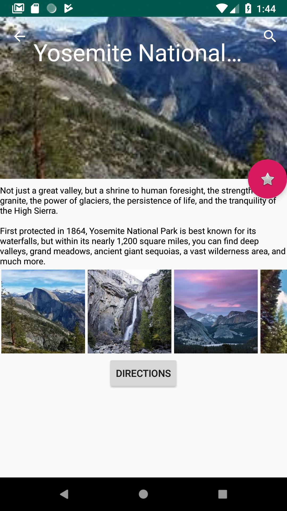

# vagabond
A national park information and campsite availibility watcher application for Android

An android app with national park information and photos, directions and stufff! I am trying to create a sample app for learning while encompassing best practices and programming techniques and libraries

Currently I use:

<ul>
  <ui>RIDB API</ui> 
  <ui>Retrofit</ui> 
  <ui>Picasso</ui> 
  <ui>MVP architecture</ui> 
  <ui>Room</ui> 
  <ui>RxJava(Trying to learn and make sense of it!)</ui>
</ul>

